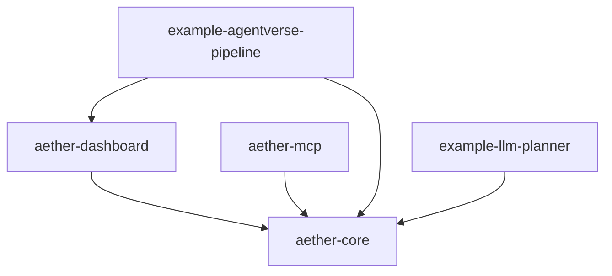

# Aether: Internal Architecture Wiki

Aether is a multi-agent orchestration framework in Rust. It composes independent AI agents — each running as a separate HTTP service that speaks the Envelope wire protocol — into DAG-based workflows, and supervises their execution with load balancing, failure recovery, conditional routing, and real-time observability. Any agent, in any language, that answers the Envelope HTTP contract can be driven by Aether.

The workspace is a small set of crates layered on a single core. `aether-core` holds the orchestration engine, the agent registry, the transport, and the durable-execution store. `aether-dashboard` and `aether-mcp` are thin service layers over that core — one for live observability, one for exposing Aether over the Model Context Protocol. The `examples/` crates demonstrate end-to-end usage, including an LLM-planner loop that builds workflows dynamically. This wiki documents those subsystems for developers working **on** Aether itself.

> **Audience:** developers **of** Aether itself. Consumer-facing
> documentation (READMEs, tutorials, API docs) lives elsewhere and is not
> duplicated here.

## System Map

*`example-llm-planner` also depends on external `agentverse-*` crates outside this workspace; see [Examples](examples.md).*

## Page Index

| Page | Covers | Summary |
| --- | --- | --- |
| [Orchestration Core](orchestration-core.md) | Registry, Supervisor, Orchestrator, Workflow/DAG builder, types, errors | The composition and execution engine: how agents are registered, workflows are built from a DAG, and a run is supervised to completion. |
| [Wire Protocol & Transport](wire-protocol-transport.md) | Envelope wire protocol, `transport/http`, `AgentFactory` | The Envelope message contract every agent speaks and the HTTP transport that carries it between the supervisor and agent processes. |
| [Durable Execution](durable-execution.md) | `execution_store`, `resume`, `instance_manager`, `health_poller`, `registry_store` | Persistence, suspend/resume, human-in-the-loop approvals, operator-driven recovery, and agent instance/health lifecycle. |
| [Dashboard](dashboard.md) | `aether-dashboard` (SSE event log, state) | The observability service: a live event stream and state snapshot of registered agents and running workflows. |
| [MCP Server](mcp-server.md) | `aether-mcp` (jsonrpc, engine, job, stdio/http) | Exposes Aether workflow execution as Model Context Protocol tools over stdio and HTTP. |
| [Examples](examples.md) | `agentverse-pipeline`, `llm-planner` | Runnable end-to-end demonstrations, including a dynamic LLM-planning loop over the `agentverse` agent stack. |

## Maintenance Convention

Every page ends with a **Source Anchors** section listing the paths it
documents. **Rule:** a PR that changes files under a page's anchors either
updates the page or says why not in the PR body. Drift is detectable
mechanically: `git log <last-commit-touching-page>.. -- <anchors>` lists
pages whose sources moved without them; the `generate-wiki` skill's
`refresh` mode automates this. There is deliberately no CI freshness gate:
gates train contributors to make no-op doc edits. Run the materialized
`check-wiki.sh` (alongside this file) to verify structural conventions.

## Page Conventions

Copy [TEMPLATE.md](TEMPLATE.md) for new pages: eight sections in order;
Mermaid-only diagrams; no line numbers (function/type/file names only);
links target only canonical page filenames; every Key Decision cites a real
PR number or commit SHA; known debt appears only under Implementation
Notes. Target 150–350 lines per page; if a draft exceeds ~400 lines it is
over-scoped.
