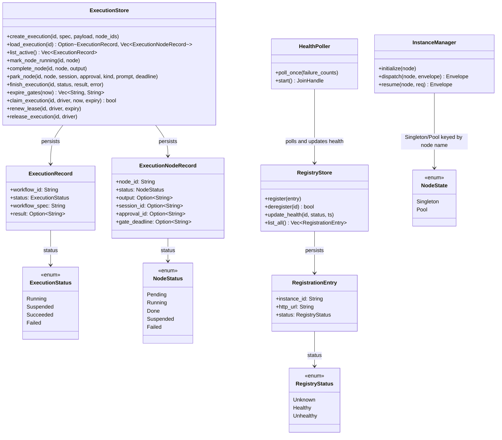

# Durable Execution

## Purpose

Durable execution is Aether's persistence and lifecycle layer. It is what
lets a workflow survive a `Supervisor` crash without re-running finished
nodes, lets a node pause indefinitely for a human decision instead of
blocking a thread, and lets an operator deliberately recover a crashed run
or approve a parked one after the fact. `ExecutionStore` is the single
source of truth for a run's status and per-node checkpoints, replacing what
used to be local variables inside the drive loop. `RegistryStore` plays the
equivalent role for the *live agent instance* side of the system — which
processes exist, where they answer HTTP, whether they're healthy —
independent of any one workflow. `InstanceManager` and `HealthPoller` turn
those persisted facts into actual dispatch and health-tracking behavior. It
exists as its own layer so the drive/compose logic in
[Orchestration Core](orchestration-core.md) doesn't have to know how a
checkpoint is stored or how a resume decision reaches a suspended agent.

## Position in the System

- Consumes: [Wire Protocol & Transport](wire-protocol-transport.md) —
  `InstanceManager::resume` and `Supervisor::resume_execution` build a
  `ResumeRequest`/`ApprovalDecision` (`resume.rs`, documented on that page)
  and deliver it over the parked node's `Transport`; a `Suspended`
  `EnvelopeKind` reply from `Transport::send` is what triggers `park_node`.
- Consumed by: [Orchestration Core](orchestration-core.md) — `Supervisor`'s
  drive loop checkpoints every node transition through `ExecutionStore` and
  holds an `InstanceManager` for dispatch; `Orchestrator` holds both
  `RegistryStore` and `ExecutionStore` and is the sole caller of
  `Supervisor::recover`/`resume_execution`. Consumed by
  [MCP Server](mcp-server.md) — the `aether-mcp` binary opens both stores
  directly and constructs the `Orchestrator` that owns them.

## Architecture

`ExecutionStore` mirrors `RegistryStore`: `rusqlite` behind
`Arc<Mutex<Connection>>`, every op via `spawn_blocking`, `CREATE TABLE IF NOT
EXISTS` in `open()` (no migration crate). `executions` holds one row per run
(status, `workflow_spec` for ready-queue rebuild, terminal `result`/`error`,
plus `claimed_by`/`lease_expiry` for the driver lease, added by an additive
`ALTER TABLE ADD COLUMN` migration in `open()`); `execution_nodes` one row per
node with a suspend-correlation group (`session_id`, `approval_id`, `kind`,
`prompt`, `gate_deadline`) populated only while parked and cleared by
`complete_node` in the same `UPDATE` that sets `status='done'`. `exec_write`
funnels single-row writes; `create_execution`/`expire_gates` use
`Connection::transaction` for atomicity.

`RegistryStore` is the equivalent store for live agent instances: `agents`
(keyed by `instance_id`, unique on `http_url`) plus an `events` table fed by
`add_event`; `register` deletes any existing same-`http_url` row first, so a
re-registering process replaces its identity instead of duplicating it.
`registry_server.rs` (`make_registry_router`) is the HTTP surface for
self-register/deregister/events, wired in `aether-core/src/bin/aether.rs` with
a `HealthPoller` over one shared `RegistryStore`. `poll_once` GETs
`{http_url}/health` on an interval, tracking consecutive misses per
`instance_id` — `Unhealthy` after 3, `Healthy` again after one success.

`InstanceManager` is `Supervisor`'s live-process handle, separate from the
`AgentRegistry` of node *definitions* (see
[Orchestration Core](orchestration-core.md)). `initialize` pre-spawns a
`Transport` for a `Singleton` (shared `Mutex`-guarded transport plus an
`AtomicUsize` pending-count checked against `max_queue`) or a `Pool`
(`size` transports, round-robined via an `AtomicUsize` cursor); `PerRequest`
gets no persistent state. `dispatch`/`resume` switch on the same three
`NodeState` shapes and apply `node.timeout`; for `PerRequest` both create a
fresh `Transport`, call it, and `shutdown` it afterward.

## Runtime Flows

**1. Checkpoint-per-transition and suspend/park (`Supervisor::drive`).**
1. `run_with_id_spec` calls `create_execution`, writing the execution row
   plus one `pending` row per node before any dispatch happens.
2. In `drive`'s `JoinSet` loop, each dispatched node calls
   `mark_node_running`, then `dispatch_with_failure_policy` over
   `InstanceManager::dispatch`.
3. A `Result` reply is checkpointed via `complete_node`, then
   `node_ready_input` computes which downstream nodes just became ready.
4. A `Suspended` reply is deserialized into `SuspendPayload` and persisted
   via `park_node` — outgoing edges do **not** fire. When `ready` drains,
   `finalize` marks the execution `Suspended` (`Outcome::Suspended`, no
   blocking) if any node is parked, else marks `Succeeded` with the
   terminal result map.

**2. Operator delivers an approval decision (`resume_execution`).**
1. `Orchestrator::resume_execution` reloads the persisted `ExecutionRecord`,
   re-parses `workflow_spec` as a `DagSpec`, and re-resolves it against the
   *current* `RegistryStore` snapshot (same reconstruction `recover` uses)
   before delegating to `Supervisor::resume_execution`.
2. `Supervisor::resume_execution` loads the parked `ExecutionNodeRecord`,
   requires `NodeStatus::Suspended` with `session_id`/`approval_id` present,
   and calls `InstanceManager::resume` with a `ResumeRequest` built from
   that correlation and the caller's `ApprovalDecision`.
3. A `Result` reply is checkpointed, the execution row reactivated to
   `Running`, and downstream edges expanded via `node_ready_input` back into
   `drive`. A `Suspended` reply re-parks the node instead; an `Error` reply
   fails the execution.

**3. Recovery after a restart (`Supervisor::recover` / `Orchestrator::recover`).**
1. An operator calls `recoverable()` (`ExecutionStore::list_active`) to see
   which executions are still `running`/`suspended`, then chooses one id.
2. `Orchestrator::recover` reloads the stored `workflow_spec`, re-resolves
   it into a fresh `AgentRegistry`/`Workflow` against the live
   `RegistryStore`, and calls `Supervisor::recover`.
3. `Supervisor::recover` rebuilds the ready queue from persisted status
   alone (`Done` nodes never re-dispatch; a ready `Pending`/`Running` node
   does — at-least-once, not exactly-once; `Suspended` nodes stay parked),
   reactivates the row to `Running`, then runs flow 1's same drive logic.

**4. Instance registration and health lifecycle.**
1. An agent process `POST`s to `/registry/agents` on the
   `make_registry_router` router, writing a `RegistryStatus::Unknown` row;
   `HealthPoller::run` then polls each `http_url`'s `/health` (see
   Architecture) to flip it `Healthy`/`Unhealthy`.
2. `Orchestrator::build_registry_and_workflow` (see
   [Orchestration Core](orchestration-core.md)) only resolves `DagNode`s
   against `Healthy` entries, so an unhealthy instance is invisible to new
   `submit`/`recover`/`resume_execution` calls without being deregistered.

## Key Decisions

### Operator-driven `resume_execution` mirrors `recover`'s reconstruction
- **Decision:** `Orchestrator::resume_execution` re-loads the persisted DAG
  and re-resolves it against the live registry exactly like `recover`,
  rather than assuming the original `submit`'s in-memory registry survives.
- **Context:** PR #5 activated an end-to-end path where a decision may
  arrive in a process that never held the original run's registry — the
  same problem `recover` solved (agents can move/restart between DAG build
  and resume) applies to resume too.
- **Alternatives rejected:** No PR or design doc records alternatives;
  `resume_execution` and `recover` duplicate the "load record → parse DAG
  → rebuild registry" sequence rather than sharing a helper.
- **Consequences:** a resume decision always reaches an agent at its
  *current* `http_url`; `resume_execution` fails outright if the parked
  node's agent can no longer be resolved.
- **Ref:** 2026-07-19, PR #5, commit `ad8f027`.

### No-concurrent-driver guard is a DB lease (claimed_by / lease_expiry)
- **Decision:** `recover`/`resume_execution`/`submit` now claim the
  `executions` row via `claim_execution` (a per-driver `claimed_by` +
  `lease_expiry`) before driving, renew it once per BFS level in `drive`,
  and release it afterward; a claim against a row a live driver still holds
  is refused with an "already being driven" `Outcome::Failed`.
- **Context:** commit `9e5e12e` warned `recover(id)` must only target
  crash/restart orphans, or two drive loops race the same rows
  (`recoverable()` returns every active row, in-flight included); PR #5
  called a stronger guard "a noted follow-up" — it landed as this lease.
- **Consequences:** the guard now covers the real **cross-process** race
  (`aether-core` and `aether-mcp` share one store), not just in-process; a
  crashed driver's lease lapses after the lease window so its orphan
  becomes reclaimable.
- **Ref:** Group B PR (gate-deadline expiry + DB driver lease, PR #9).

### Persistent `ExecutionStore` becomes load-bearing; in-memory constructors deleted
- **Decision:** `Orchestrator::new` now requires a caller-supplied
  `ExecutionStore`; `ExecutionStore::open_in_memory`, `RegistryStore::open_in_memory`,
  and `Supervisor::new` were deleted outright.
- **Context:** PR #4's body: "durability is landed but DORMANT... Nothing
  yet uses `with_store` with a file-backed store." PR #5's body: "removes
  the in-memory store constructors that silently threw away durable state."
- **Alternatives rejected:** keeping the constructors as an opt-in fast
  path was rejected implicitly by deleting rather than keeping both — the
  PR frames this as closing a foot-gun.
- **Consequences:** every construction path now requires a real SQLite
  file; tests switched to unique temp files so drop-and-reopen exercises a
  true restart.
- **Ref:** 2026-07-18, PR #5, commit `ce9db10`.

### Store-driven, re-entrant `Supervisor::drive` replaces the single blocking pass
- **Decision:** `execute_dag`'s local `node_outputs`/`fan_in_accum`/`ready`
  variables were replaced by an `ExecutionStore`-backed loop that
  checkpoints each result before expanding edges, returning control the
  moment any node parks instead of blocking.
- **Context:** the design doc (untracked) states the gap directly: "If the
  Supervisor process dies mid-workflow, the entire run is lost." It frames
  the chosen shape against two rejected alternatives: a per-agent durable
  runtime (§2.1, harder to recover/debug) and Temporal (§2.2, unneeded
  weight on a DAG engine Aether already is), accepting Temporal's automatic
  infra-recovery and exactly-once guarantees as a trade-off given up.
- **Alternatives rejected:** see above.
- **Consequences:** recovery is at-least-once — a crash between an agent's
  reply and the checkpoint commit re-dispatches that node on `recover`;
  fan-in readiness (`node_ready_input`) is derived from the store, not
  memory, so it survives a restart.
- **Ref:** 2026-07-18, PR #4, commit `deda12f`.

### Gate-deadline expiry is an on-demand sweep, not a background job
- **Decision:** `expire_gates(now)` sweeps every `suspended` node whose
  `gate_deadline` passed, failing node and execution in one transaction — a
  method a caller invokes, not a `tokio::spawn`ed loop. An operator triggers
  it via the `aether-mcp expire-gates` CLI subcommand or the `expire_gates`
  MCP tool, both calling `Orchestrator::expire_gates`.
- **Context:** the design doc's §6: "Aether mirrors an optional
  workflow-level `gate_deadline` on a parked node; on expiry the node →
  `failed`... so an unanswered gate cannot park a run forever."
- **Alternatives rejected:** no PR or design doc records why a background
  loop wasn't chosen. A parked node's deadline is `SuspendPayload.
  gate_deadline` (agent override) else `gate_deadline_secs` (`now + secs`).
- **Consequences:** an unanswered gate cannot park a run forever *once an
  operator runs the sweep* — the guarantee is operator-invoked, not automatic.
- **Ref:** 2026-07-18, PR #4, commit `b8dd0d3`.

### SQLite-backed `RegistryStore` for durable, cross-process agent registration
- **Decision:** live agent registration lives in its own `rusqlite`-backed
  `RegistryStore`, structurally the pattern `ExecutionStore` later mirrors.
- **Context:** commit `d10ec09`: "Introduces `RegistryStore` backed by
  rusqlite with WAL mode... All SQLite operations run inside
  `spawn_blocking` via `Arc<Mutex<Connection>>`."
- **Alternatives rejected:** No PR or design doc records alternatives; this
  replaced an earlier socket-path-keyed scheme when the transport moved to
  HTTP (see [Wire Protocol & Transport](wire-protocol-transport.md)).
- **Consequences:** agent registration survives a registry process
  restart; `Orchestrator` resolves every DAG node against a snapshot rather
  than a registry needing re-population per restart.
- **Ref:** 2026-05-21, commit `d10ec09`.

## Implementation Notes

- **Now wired:** both prior "known debt" items are resolved (see Key
  Decisions above): `expire_gates` is reachable via the CLI subcommand and
  MCP tool with a real `park_node` deadline (no longer hardcoded `None`),
  and the no-concurrent-driver guard is now the DB lease
  (`claim_execution`/`renew_lease`/`release_execution`), not a doc comment.
- **Invariant:** `complete_node` is the only path to `NodeStatus::Done` and
  unconditionally clears suspend correlation in the same `UPDATE` (see Key
  Decisions above); any future write path to `done` must preserve this.
- **Invariant:** `recover` and `resume_execution` both reactivate the
  execution row to `Running` before calling `drive`, even though it may
  last have been written `Suspended` — otherwise a run that ultimately
  succeeds would still read back as `Suspended` if `finalize` were skipped.
- **Fixed (perf):** `drive` loads one `load_execution` snapshot per BFS
  level for the pure `ready_input_from_snapshot` helper, not one round trip
  per edge; `node_ready_input` is now a thin loader over it.
- **Gotcha (now observable):** `RegistryStore::register`'s same-`http_url`
  re-registration still deletes the prior row, but `register` now returns
  the displaced `instance_id` and `registry_server.rs` logs a `tracing::warn!`
  — superseded, but no longer silent.
- **Invariant:** `InstanceManager::dispatch` and `::resume` route through
  the identical `Singleton`/`Pool`/`PerRequest` match — see
  [Wire Protocol & Transport](wire-protocol-transport.md) for the resume
  wire contract these calls carry.

## Source Anchors

- `aether-core/src/execution_store.rs`
- `aether-core/src/resume.rs`
- `aether-core/src/instance_manager.rs`
- `aether-core/src/health_poller.rs`
- `aether-core/src/registry_store.rs`
- `aether-core/src/registry_server.rs`
- `aether-core/src/supervisor.rs`
- `aether-core/src/orchestrator.rs`
- `aether-core/src/bin/aether.rs`

<!-- The drift contract: a PR changing files under these anchors updates this page
     or says why not in the PR body. -->

## Related Pages

- [Orchestration Core](orchestration-core.md)
- [Wire Protocol & Transport](wire-protocol-transport.md)
- [Dashboard](dashboard.md)
- [MCP Server](mcp-server.md)
- [Examples](examples.md)
