# Examples

## Purpose

`examples/` holds two runnable, workspace-member crates that exercise
Aether against live HTTP agents rather than mocks: `agentverse-pipeline`, a
minimal static two-node pipeline, and `llm-planner`, a dynamic
LLM-planning loop that also demonstrates the durable suspend/resume path.
They exist to prove the framework end to end — registry seeding, capability
resolution, parallel fan-out/fan-in, HITL suspension, and dashboard
mounting — against real agent processes speaking the wire protocol, not
just unit tests. Both are leaf crates: they depend on `aether-core` and
(for one) `aether-dashboard`, and nothing in the workspace depends on them
back.

## Position in the System

- Consumes: [Orchestration Core](orchestration-core.md) — `agentverse-pipeline`
  builds an `AgentRegistry`/`Workflow` directly and drives it with
  `Supervisor::run`; `llm-planner`'s driver instead calls
  `Orchestrator::submit_with_id`, letting `build_registry_and_workflow`
  turn a planner-emitted `DagSpec` into a `Workflow`.
- Consumes: [Wire Protocol & Transport](wire-protocol-transport.md) — both
  examples register `HttpAgentFactory` nodes with `SpawnPolicy::PerRequest`,
  so every dispatch opens a fresh `HttpTransport` to a separately-running
  agent process.
- Consumes: [Durable Execution](durable-execution.md) — both open a real
  `aether_core::ExecutionStore` (SQLite file, no in-memory constructor);
  `llm-planner`'s driver additionally opens a `RegistryStore` to seed six
  agent registrations, and drives suspend/resume via
  `Orchestrator::suspended_node` / `Orchestrator::resume_execution`.
- Consumes: [Dashboard](dashboard.md) — `agentverse-pipeline` is the one
  example that mounts it: `aether_dashboard::start` wraps the same
  `Supervisor` (via `AppState::new`) that drives the pipeline.
- Consumes an **external** agent stack: `llm-planner`'s `Cargo.toml`
  path-depends on `agentverse`, `agentverse-agent` (feature `http`),
  `agentverse-hitl`, `agentverse-session`, `agentverse-strategy`, and
  `agentverse-tools`, all resolved at `../../../agentverse` — a sibling
  checkout outside this workspace. Only the boundary each example crosses
  (`Agent::builder`, `LlmRunner`, `HitlPolicy`, `RunStrategy`) is
  documented here.
- Consumed by: nothing — both are `[[bin]]` targets with no library crate
  depending on them.

## Architecture

```mermaid
classDiagram
    class AgentversePipelineMain {
        +main()
    }
    class LlmPlannerMain {
        +main()
    }
    class LlmPlannerAgentBin {
        +main()
        +role_config(role)
    }
    class ExecCommandTool {
        +execute(args) ToolResult
    }
    class PromptsModule {
        +planner_prompt() String
        +EXEMPLAR_DAG
    }
    class SuspendResumeE2eTest {
        +suspend_resume_e2e_against_builtin_server()
    }
    class SuspendOnceStrategy {
        +run(messages) Result~StrategyOutcome,AgentError~
    }

    class AgentRegistry
    class Workflow
    class Supervisor
    class Orchestrator
    class RegistryStore
    class ExecutionStore
    class AppState
    class HttpAgentFactory
    class Agent
    class HitlConfig

    AgentversePipelineMain --> AgentRegistry : registers analyst/writer nodes
    AgentversePipelineMain --> Workflow : edge analyst to writer
    AgentversePipelineMain --> Supervisor : with_store then run
    AgentversePipelineMain --> AppState : mounts dashboard over same Supervisor
    AgentversePipelineMain --> HttpAgentFactory : PerRequest per node

    LlmPlannerMain --> RegistryStore : seeds six capability to URL rows
    LlmPlannerMain --> Orchestrator : submit_with_id then poll suspended_node
    LlmPlannerAgentBin --> Agent : builder + with_http_server
    LlmPlannerAgentBin --> PromptsModule : role to system prompt
    LlmPlannerAgentBin --> HitlConfig : with_hitl for the assess_cost role
    LlmPlannerAgentBin --> ExecCommandTool : registered only when is_hitl

    SuspendResumeE2eTest --> SuspendOnceStrategy : stub RunStrategy, no live LLM
    SuspendResumeE2eTest --> Orchestrator : submit_with_id
    SuspendResumeE2eTest --> Supervisor : resume_execution
```

`agentverse-pipeline`'s `main` is the simpler of the two: it builds an
`AgentRegistry` with exactly two `AgentNode`s (`analyst`, `writer`), each
an `HttpAgentFactory` pointed at an env-configured URL
(`ANALYST_URL`/`WRITER_URL`), wires a single `Workflow::builder(...).edge
("analyst", "writer")`, opens an `ExecutionStore`, and calls
`Supervisor::with_store(registry, execution_store)` then `.run(&workflow,
initial)`. It also constructs `aether_dashboard::AppState::new` around the
*same* `Arc<Supervisor>` and calls `aether_dashboard::start`, so the
dashboard observes this run live — the one place in `examples/` where the
dashboard is wired up.

`llm-planner` splits across three binaries plus a shared prompts module.
`src/bin/agent.rs` (binary `llm-planner-agent`, launched once per role by
`run.sh`) maps a `ROLE` env value to a system prompt via `role_config`,
builds one `agentverse::LlmRunner`, wraps the prompt in a `PromptRegistry`,
and constructs an `Agent` via `Agent::builder(...).with_http_server()`;
only the `assess_cost` role additionally registers `ExecCommandTool` in a
`ToolRegistry` and calls `.with_hitl(HitlConfig { policy:
HitlPolicy::new(), queue: Arc::new(InMemoryQueue::new()) })`. `src/main.rs`
(binary `llm-planner`) is the orchestrator-side driver: it never builds an
`Agent` itself — it opens a `RegistryStore`, registers the six
role/port/capability rows from its `AGENTS` constant as `Healthy`, then
calls `aether_core::Orchestrator::submit_with_id`. `prompts.rs` is
included into `agent.rs` via `#[path = "../prompts.rs"]` and holds the
per-role system prompts plus `EXEMPLAR_DAG`, a pinned diamond-shaped
`DagSpec` used both as the planner's few-shot example and as a unit-test
guard (`exemplar_dag_parses_and_validates`) against prompt drift.
`tests/suspend_resume_e2e.rs` builds a real `Agent` whose `RunStrategy` is
the local `SuspendOnceStrategy` stub — its first `run` call returns
`StrategyOutcome::Interrupted`, every later call returns
`StrategyOutcome::Done` — so the suspend is deterministic without a live
model, while the agent's production `invoke`/`resume` machinery and
`aether-core`'s `Orchestrator`/`Supervisor` are exercised unmodified.

## Runtime Flows

**1. `agentverse-pipeline`: two-node HTTP pipeline under the dashboard.**
1. `main` registers `analyst` and `writer` as `HttpAgentFactory` nodes
   (`SpawnPolicy::PerRequest`, one retry each) and builds a single-edge
   `Workflow`.
2. `Supervisor::with_store` pairs that registry with a file-backed
   `ExecutionStore`; `aether_dashboard::start` mounts `AppState` around the
   same `Arc<Supervisor>` on port `7700` before the run starts, so the
   dashboard can observe it live.
3. `supervisor.run(&workflow, initial)` dispatches `analyst` first, then
   `writer` on the analyst's output; `main` matches the returned `Outcome`
   (`Success`, `Failed`, `Timeout`, or `Suspended`) and prints accordingly,
   then keeps the dashboard alive for 60 seconds.

**2. `llm-planner`: dynamic plan, parallel fan-out, HITL suspend, auto-resume.**
1. The driver (`main.rs`) seeds a `RegistryStore` with six rows (`planner`
   at `plan`, `context` at `gather_context`, `pros`/`cons`/`cost` at their
   `analyze_*`/`assess_cost` capabilities, `synth` at `synthesize`), each
   pointing at `http://127.0.0.1:<port>` for a separately-running
   `llm-planner-agent` process, then calls `Orchestrator::submit_with_id`.
2. `Orchestrator::submit_with_id` resolves the `plan` capability, invokes
   the planner agent, and extracts the DAG from its built-in-server
   `{"output": "<dag json>"}` result via `dag_from_planner_result` (tolerant
   of markdown fences/prose) before parsing it with `DagSpec::parse` and
   handing the resolved `Workflow` to a fresh `Supervisor`.
3. The `context` entry node runs, then `analyze_pros`/`analyze_cons`/
   `assess_cost` dispatch in parallel; `assess_cost`'s agent process is the
   one built with `HitlConfig`, so a real tool call to its blocklisted
   `exec_command` tool suspends that node — the run stops as
   `Outcome::Suspended` without firing `synthesize`.
4. The driver loops: `Orchestrator::suspended_node(workflow_id)` names the
   parked node, `Orchestrator::resume_execution(workflow_id, &node,
   ApprovalDecision::Approved)` re-resolves the persisted DAG against the
   live registry and re-drives it; once every gate clears, the three
   analysts' outputs fan in as a JSON array to `synthesize`, and the driver
   reads the terminal result's `["output"]` field.

**3. `suspend_resume_e2e_against_builtin_server`: deterministic proof of flow 2's suspend/resume step.**
1. `spawn_worker_agent` serves one real `Agent` (via `with_http_server` +
   `with_hitl`) on a fixed loopback port, running `SuspendOnceStrategy`;
   `spawn_planner` serves a plain one-node `DagSpec` from a hand-built axum
   route (the only piece of this test that is not a real AgentVerse agent).
2. `Orchestrator::new(registry_store, exec_store).submit_with_id` dispatches
   the one-node workflow; the worker's first `run` call yields
   `StrategyOutcome::Interrupted`, so the test asserts `Outcome::Suspended`
   and that the parked `ExecutionNodeRecord` carries a `session_id` and
   `approval_id`.
3. The test rebuilds a fresh one-node `AgentRegistry`/`Workflow` pointed at
   the same worker URL, shares the same `ExecutionStore`, and calls
   `Supervisor::resume_execution(wid, &workflow, "n1",
   ApprovalDecision::Approved)`; the worker's second `run` call returns
   `StrategyOutcome::Done`, and the test asserts `Outcome::Success` with the
   execution row read back as `Succeeded`.

## Key Decisions

Newest first.

### Agent binary defaults to a loopback bind, not the built-in server's default
- **Decision:** `src/bin/agent.rs` sets `HOST=127.0.0.1` before building the
  `Agent` unless the caller already set `HOST`, overriding the AgentVerse
  built-in server's own default of `0.0.0.0`.
- **Context:** commit `50fd92a`'s message: "the agents shipped with
  `ALLOW_INSECURE=true` were binding all interfaces unauthenticated despite
  the 'loopback dev' comment... [now] the shipped binary matches the e2e
  test and the stated intent."
- **Alternatives rejected:** leaving the built-in `0.0.0.0` default in
  place (the pre-fix behavior) was rejected as an unauthenticated
  all-interfaces bind wider than the example's own "loopback dev" comment
  claimed.
- **Consequences:** all six agent processes are unreachable from outside
  the host unless an operator overrides `HOST`; mirrors the loopback-only
  invariant [MCP Server](mcp-server.md) documents for `aether-mcp`'s HTTP
  transport.
- **Ref:** 2026-07-19, commit `50fd92a`.

### DAG extraction is prompt-only, text-sliced from the built-in server's `output` field — no structured-output call
- **Decision:** `aether-core`'s `dag_from_planner_result` locates the DAG's
  JSON object by slicing from the first `{` to the last `}` in the built-in
  server's `Done` → `{"output": "<text>"}` result (tolerating markdown
  fences/prose) before `DagSpec::parse`. An earlier iteration (commit
  `7c777d7`, "wire `invoke_structured` for planner") called a
  schema-constrained `invoke_structured` API instead; that call no longer
  exists anywhere in the codebase.
- **Context:** the untracked rebase plan states: "the built-in server has
  no per-request JSON-schema mode, so the planner relies on its system
  prompt... plus the tolerant `dag_from_planner_result` extractor," and
  lists structured output as an out-of-scope follow-up ("would require an
  agentverse change, which this plan avoids").
- **Alternatives rejected:** keeping `invoke_structured` was foreclosed by
  the built-in server's fixed envelope contract, not chosen against —
  moving every agent onto `with_http_server()` (below) removed the code
  path it had been called from.
- **Consequences:** planner reliability depends entirely on prompt
  adherence (`planner_prompt`'s "Output ONLY the JSON object") plus the
  tolerant extractor; an invalid response surfaces honestly as
  `Outcome::Failed` — no hardcoded DAG is substituted.
- **Ref:** 2026-07-19, commit `5419599` (extractor); untracked rebase plan
  (Notes/Deferred).

### `llm-planner` rebased onto the AgentVerse built-in agent server; hand-rolled per-agent axum server dropped
- **Decision:** each of the six roles now runs as its own OS process — the
  `llm-planner-agent` binary — serving `/aether/invoke` and
  `/aether/resume` via `with_http_server()`, replacing an earlier design
  where `main.rs` spawned five in-process axum servers directly
  (`src/agent.rs`, deleted).
- **Context:** the untracked rebase plan's goal: "so all six agents serve
  the real `/aether/invoke` + `/aether/resume` endpoints and the example
  proves the durable suspend/resume loop end-to-end" — the hand-rolled
  server had no `/aether/resume` route, so it could not demonstrate
  suspend/resume at all.
- **Alternatives rejected:** commit `ac59813`'s message notes the built-in
  server "reads a single `HOST`/`PORT` from env and so cannot host six
  agents on six ports within one process" — the original design doc's own
  reason for choosing hand-rolled servers; the rebase resolves that by
  giving each role its own process instead.
- **Consequences:** running the example now requires launching six
  processes (`run.sh` does this) instead of one; the driver (`main.rs`) no
  longer builds any `Agent`, only a `RegistryStore` pointed at the six
  external processes.
- **Ref:** 2026-07-19, commits `ac59813`, `77e9579`, `5190bc8`, `2f0ef02`.

### `assess_cost` is the designated HITL-suspend demo, gated by a blocklisted `exec_command` tool
- **Decision:** only the `assess_cost` role registers `ExecCommandTool` and
  attaches `HitlConfig`; `exec_command` sits in `HitlPolicy::new()`'s
  global tool blocklist, so a real invocation suspends that agent, which
  the driver observes as `Outcome::Suspended` and auto-approves in a loop.
- **Context:** the untracked rebase plan: "a gated tool named
  `exec_command`... makes an agent suspend without any skill config,"
  naming the deterministic e2e test's stub interrupt as "the source of
  truth for correctness," with the live run treated as a best-effort smoke
  test dependent on the model actually calling the gated tool.
- **Alternatives rejected:** No PR or design doc records why `assess_cost`
  specifically (versus another analyst role) was chosen; observed current
  state: it is the only role `role_config` marks `is_hitl = true`.
- **Consequences:** the live run's suspend/resume demo is only as reliable
  as the local model's willingness to call `exec_command`; the
  deterministic outcome is guaranteed only by `suspend_resume_e2e.rs`'s
  stub strategy, not the live path.
- **Ref:** 2026-07-19, untracked rebase plan; commit `2f0ef02`.

### A diamond DAG shape is required, not a flat fan-out, because `DagSpec::validate` enforces exactly one entry and one terminal node
- **Decision:** `planner_prompt` mandates a single `gather_context` entry
  feeding three parallel analysts that converge on one `synthesize`
  terminal, rather than three independent entry nodes.
- **Context:** the untracked original design doc: "`DagSpec::validate`
  requires exactly **one** entry node... and exactly **one** terminal
  node. Three analysts with empty `depends_on` would be three entries —
  rejected." PR #1's review-fixes note lists this as finding #4, fixed by
  requiring exactly one terminal (commit `8eb4426`) so multiple unmerged
  terminals can't yield a non-deterministic final result.
- **Alternatives rejected:** a flat three-entry fan-out (no shared
  `context` node) was the design doc's explicitly rejected starting point,
  ruled out by the validator.
- **Consequences:** the planner prompt and `EXEMPLAR_DAG` must keep
  encoding this shape; `prompts.rs`'s `exemplar_dag_parses_and_validates`
  test guards against prompt edits drifting the exemplar out of a
  validatable shape.
- **Ref:** 2026-06-23, untracked design doc
  (`2026-06-23-llm-planner-example-design.md`); PR #1, commit `8eb4426`.

## Implementation Notes

- **Build state (verified):** `cargo build -p example-llm-planner -p
  example-agentverse-pipeline` and `cargo test -p example-llm-planner
  --test suspend_resume_e2e` both succeed as of this page (against the
  sibling `agentverse` checkout at `../../../agentverse`). This was
  **not always true**: commit `829b9ff`'s message states
  "`example-llm-planner` remains broken only by its pre-existing E0223"
  (an invalid `ProviderConfig::OpenAI { .. }` struct-variant); commit
  `2f0ef02` fixed it by switching to `ProviderConfig::openai(..)` in the
  same change that added `suspend_resume_e2e.rs`.
- **External-crate boundary:** `llm-planner`'s six path dependencies
  resolve outside this workspace (`../../../agentverse/avs-*`); this page
  documents only the boundary calls (`Agent::builder`, `LlmRunner`,
  `HitlPolicy`, `RunStrategy`, `PromptRegistry`) — `avs-agent`'s HTTP
  server, `avs-hitl`'s policy engine, and `avs-strategy`'s ReAct loop were
  not inspected to write this page.
- **Portability caveat (untracked design doc):** the cross-repo path
  dependency ties `llm-planner` to a sibling checkout — "fine locally, not
  publishable standalone," per the original design doc; the README
  repeats this as a stated prerequisite.
- **`run.sh` requires bash >= 4** for its associative array of role→port —
  commit `4e24ec6` notes macOS's system `/bin/bash` is 3.2 and a newer
  bash must come from Homebrew; the README documents this.
- **Live-run reliability is best-effort, not tested:** per the rebase
  plan's Notes/Deferred, "the deterministic test is the source of truth
  for correctness" for the suspend/resume path; a live `run.sh` run
  against a real model is a manual smoke test, not CI-covered, and its
  planner-quality and HITL-triggering behavior depend on `MODEL_NAME`.
- **Dashboard coverage is asymmetric:** only `agentverse-pipeline` mounts
  [Dashboard](dashboard.md); the untracked design doc states the
  llm-planner's `Orchestrator`-driven run "creates its own internal
  `Supervisor`... which is not the Supervisor a dashboard `AppState` would
  wrap" without an `aether-core` change that "has not landed" — so
  `llm-planner` remains console-only (stdout result, stderr `tracing`
  logs) by necessity, not choice.

## Source Anchors

- `examples/agentverse-pipeline/src/main.rs`
- `examples/agentverse-pipeline/Cargo.toml`
- `examples/llm-planner/src/main.rs`
- `examples/llm-planner/src/prompts.rs`
- `examples/llm-planner/src/bin/agent.rs`
- `examples/llm-planner/tests/suspend_resume_e2e.rs`
- `examples/llm-planner/run.sh`
- `examples/llm-planner/Cargo.toml`

<!-- The drift contract: a PR changing files under these anchors updates this page
     or says why not in the PR body. -->

## Related Pages

- [Orchestration Core](orchestration-core.md)
- [Wire Protocol & Transport](wire-protocol-transport.md)
- [Durable Execution](durable-execution.md)
- [Dashboard](dashboard.md)
- [MCP Server](mcp-server.md)
