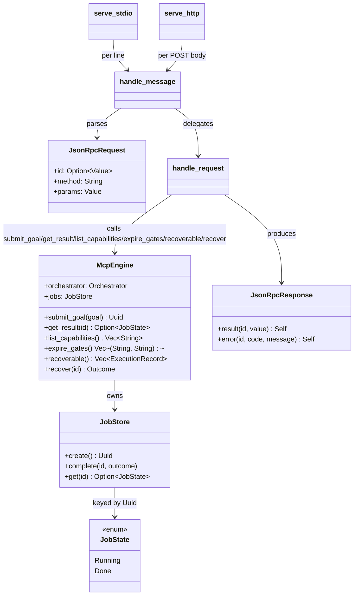

# MCP Server

## Purpose

`aether-mcp` is a thin sidecar crate + binary that exposes Aether's goal
dispatch as Model Context Protocol tools over JSON-RPC 2.0, reachable over
either stdio or HTTP. It wraps the same `Orchestrator::submit`/
`submit_with_id` entry point used by any other caller — it adds an
interface, not new orchestration logic — so `aether-core` stays
transport-agnostic and the sidecar can be deployed and versioned
independently. It exists as its own crate so MCP framing (JSON-RPC
envelopes, tool descriptors, stdio/HTTP wire formats) never leaks into the
orchestration engine, mirroring how the reference planner project
(AgentVerse, untracked design doc) keeps its own MCP server (`avs-mcp`)
separate from its planning core.

## Position in the System

- Consumes: [Orchestration Core](orchestration-core.md) — `McpEngine` holds
  an `Orchestrator` and calls `submit_with_id`, `list_capabilities`, and
  (transitively, via `Orchestrator::new`) the registry bridge that turns a
  `DagSpec` into a running `Workflow`.
- Consumes: [Durable Execution](durable-execution.md) — the `aether-mcp`
  binary opens both a `RegistryStore` and an `ExecutionStore` directly (real
  SQLite files, no in-memory constructors) and hands them to
  `Orchestrator::new`, which the resulting `McpEngine` then owns.
- Consumed by: external MCP clients — not represented as a wiki page; an MCP
  client speaks JSON-RPC to this crate's `tools/list`/`tools/call` surface
  over whichever transport the binary was started with.

## Architecture

`McpEngine` (`engine.rs`) is a cheap `Clone` pairing an `Orchestrator` (see
[Orchestration Core](orchestration-core.md)) with a `JobStore`. `JobStore`
(`job.rs`) is `Arc<Mutex<HashMap<Uuid, JobState>>>` behind `create`/
`complete`/`get`; `JobState` is a two-variant enum, `Running` or
`Done { result: Outcome }`, serialized with `#[serde(tag = "status")]` so a
polling client sees `{"status": "running"}` or
`{"status": "done", "result": ...}`. `jsonrpc.rs` defines the wire types
(`JsonRpcRequest`, `JsonRpcResponse`, `JsonRpcError`) and two entry points:
`handle_message` (parses a raw string, returns a `-32700` error response on
malformed JSON) and `handle_request` (dispatches a parsed request by
`method`: `initialize`, `tools/list`, `tools/call`, or a `-32601` error for
anything else). `tool_descriptors()` hard-codes six tool schemas
(`submit_goal`, `get_result`, `list_capabilities`, `expire_gates`,
`list_recoverable`, `recover_workflow`); `handle_tool_call` matches
`params.name` against the same six strings and wraps every
successful result as MCP `content` (a single `text` block holding a
JSON-encoded string) via `tool_content`. `stdio.rs` and `http.rs` are both
thin: each transport's job is only to get a raw JSON-RPC string into
`handle_message` and a response back out over its own wire format. The
binary (`bin/aether-mcp.rs`) reads environment variables to build one
`McpEngine` and picks a transport.

## Runtime Flows

**1. A JSON-RPC request arrives and is dispatched to a tool.**
1. `serve_stdio` reads one line at a time from stdin (blank lines skipped)
   and calls `process_line`, which forwards to `handle_message`; `serve_http`
   reads a POST body's raw `Bytes` and also calls `handle_message` — both
   transports share this one dispatch path, so parse-error and notification
   behavior is identical on both.
2. `handle_message` parses the raw string into `JsonRpcRequest` (a parse
   failure short-circuits to a `-32700` error response with a `null` id) and
   calls `handle_request`.
3. `handle_request` reads `req.id`: a request with no `id` is a JSON-RPC
   notification (`§4.1`), and the function returns `None` — stdio emits
   nothing for it, HTTP's `handle` maps `None` to `202 Accepted` with an
   empty body.
4. For `tools/call`, `handle_tool_call` matches `params.name` against
   `"submit_goal"`, `"get_result"`, `"list_capabilities"`, `"expire_gates"`,
   `"list_recoverable"`, or `"recover_workflow"` and calls the matching
   `McpEngine` method, wrapping the JSON result via `tool_content` or
   returning a JSON-RPC `-32602`/`-32000`/`-32001` error.

**2. `submit_goal` is asynchronous: it returns immediately and is polled via
`get_result`.**
1. `McpEngine::submit_goal` calls `JobStore::create()` to mint a `Uuid` and
   insert a `JobState::Running` entry, then `tokio::spawn`s a task that calls
   `Orchestrator::submit_with_id(id, goal)` and, on completion,
   `JobStore::complete(id, outcome)` — `submit_goal` itself returns the
   `Uuid` without awaiting the spawned task.
2. `handle_tool_call`'s `"submit_goal"` arm serializes that `Uuid` as
   `{"workflow_id": "..."}`, so the client-visible poll handle is the same
   id that `Orchestrator::submit_with_id` stamps on every `SupervisorEvent`
   the run emits (see [Orchestration Core](orchestration-core.md)).
3. A client calls `get_result` with that `workflow_id`; `McpEngine::get_result`
   parses it back into a `Uuid` and calls `JobStore::get`, returning
   `JobState::Running` while the spawned task is still in flight,
   `JobState::Done { result }` once `complete` has run, or (if the id is
   unrecognized) a JSON-RPC **error** (`-32001`, `"unknown workflow_id:
   {id}"`) from `handle_tool_call`.

**3. The binary selects a transport and opens durable stores at startup.**
1. `main` in `bin/aether-mcp.rs` reads `AETHER_DB_PATH` (default
   `aether.db`), `AETHER_EXEC_DB_PATH` (default `aether-executions.db`),
   `AETHER_MCP_TRANSPORT` (default `"stdio"`), and `AETHER_MCP_PORT`
   (default `7800`) from the environment.
2. It opens a real `RegistryStore` and a real `ExecutionStore` against those
   paths (`RegistryStore::open`, `aether_core::ExecutionStore::open`; both
   `.expect()` on failure — there is no fallback in-memory store) and builds
   one `McpEngine::new(Orchestrator::new(store, execution_store))`.
3. A `match` on `AETHER_MCP_TRANSPORT` calls `http::serve_http(engine, addr)`
   when the value is `"http"` (binding `127.0.0.1:{port}`), and
   `stdio::serve_stdio(engine)` for every other value, including the
   default.

## Key Decisions

Newest first.

### `aether-mcp` opens real `RegistryStore`/`ExecutionStore` everywhere, no in-memory fallback
- **Decision:** the binary and every test in `aether-mcp` (`engine.rs`,
  `jsonrpc.rs`, `stdio.rs`, `http.rs`, `tests/engine.rs`) construct
  `Orchestrator::new` from a `RegistryStore::open(path)` and an
  `aether_core::ExecutionStore::open(path)` against a real (temp-file, in
  tests) SQLite file, rather than an in-memory constructor.
- **Context:** commit `829b9ff`'s body: "Repairs downstream callers after
  aether-core removed `Supervisor::new` and the in-memory store
  constructors: aether-mcp (tests + bin)... now open real SQLite files. No
  recovery call is added anywhere."
- **Alternatives rejected:** No PR or design doc records alternatives; this
  is a mechanical repair reacting to an upstream removal in `aether-core`
  (see [Durable Execution](durable-execution.md)), not a design choice made
  within this crate.
- **Consequences:** every path that builds an `McpEngine` — including this
  crate's own tests — now does real file I/O to open two SQLite databases;
  the binary still never calls `Orchestrator::recover` on startup, so a
  prior crash leaves orphaned execution rows until an operator inspects and
  recovers them (see Implementation Notes).
- **Ref:** 2026-07-18, commit `829b9ff`.

### `submit_goal`'s poll handle becomes the real `workflow_id`, not a private job id
- **Decision:** `Supervisor::run_with_id` / `Orchestrator::submit_with_id`
  thread a caller-supplied `Uuid` through, and `McpEngine::submit_goal` uses
  that same id both as the `JobStore` key and as the id it returns to the
  MCP client, so the value a client polls with is identical to the
  `workflow_id` stamped on every `SupervisorEvent` the run emits.
- **Context:** PR #1's review-fixes note lists finding #3: "`submit_goal`
  returned a private job id, not the workflow id" — fixed per the same PR
  body by threading the id through `Supervisor::run_with_id` /
  `Orchestrator::submit_with_id`.
- **Alternatives rejected:** keeping a separate MCP-internal job id (mapped
  to the workflow id server-side) was the pre-fix behavior, rejected because
  it made a client's id useless for correlating against dashboard/event
  output for the same run.
- **Consequences:** `JobStore`'s key space and `Orchestrator`'s workflow-id
  space are the same `Uuid` space by construction — a client can take a
  `workflow_id` from `submit_goal` and use it directly against anything else
  in the system keyed by workflow id.
- **Ref:** 2026-06-23, PR #1, commit `8eb4426`.

### JSON-RPC notification handling and HTTP transport parity with stdio
- **Decision:** `handle_request` returns `Option<JsonRpcResponse>` — `None`
  for a request with no `id` (a notification) — so stdio emits nothing and
  HTTP's `handle` maps that to `202 Accepted`; the HTTP body is parsed from
  raw `Bytes` (not axum's `Json` extractor) so malformed JSON produces the
  same `-32700` JSON-RPC error stdio produces, instead of axum's generic
  `422`; and `GET /` on the HTTP transport returns `405` rather than opening
  a server-to-client SSE stream.
- **Context:** PR #1's review-fixes note lists three findings this commit
  addresses: "(1) MCP server replied to JSON-RPC notifications, breaking the
  handshake... (2) HTTP transport wasn't a defensible MCP Streamable HTTP
  server... (5) Malformed HTTP body returned axum `422`, not a JSON-RPC
  error." The PR body adds: "for #2 the HTTP transport responds with JSON
  and declines SSE rather than implementing a full bidirectional SSE
  stream — proportionate to a push-less submit+poll server (streaming
  progress is a documented non-goal). A live SSE stream remains a possible
  follow-up."
- **Alternatives rejected:** a full bidirectional SSE channel on `GET /` was
  considered and explicitly deferred, not rejected outright — the PR body
  frames it as a possible follow-up rather than ruled out.
- **Consequences:** both transports share one behavior for notifications and
  malformed input via the common `handle_message` path; the HTTP transport
  can never push unsolicited messages to a client (no progress streaming) —
  a client must poll `get_result`.
- **Ref:** 2026-06-23, PR #1, commit `8eb4426`.

### MCP surface over JSON-RPC with both stdio and HTTP transports
- **Decision:** `aether-mcp` exposes one shared tool set — 3 tools at this
  PR (`submit_goal`, `get_result`, `list_capabilities`), grown since to 6
  total with `expire_gates`, `list_recoverable`, and `recover_workflow` —
  over two independently selectable transports — line-delimited JSON-RPC on
  stdio (`stdio.rs`) and POST-per-message JSON-RPC over HTTP (`http.rs`) —
  both built on the same `handle_message` dispatch.
- **Context:** the llm-planner design doc's Stage 2 section (untracked)
  states: "Support both stdio and streamable HTTP/SSE behind the same tool
  implementations: HTTP/SSE matches aether's HTTP-everywhere model and the
  networked multi-agent reality... stdio supports a single co-located MCP
  client and is simplest to test," citing AgentVerse's `avs-mcp` as
  supporting both already.
- **Alternatives rejected:** the design doc frames stdio-only as
  insufficient for "multiple remote agents connect[ing] concurrently," and
  HTTP-only as losing the simplest local-client/test path — hence both,
  sharing one dispatch implementation rather than two.
- **Consequences:** every new tool or JSON-RPC method only needs to be added
  once in `jsonrpc.rs` to be available on both transports; the binary's
  `AETHER_MCP_TRANSPORT` variable picks exactly one transport per process —
  there is no mode that serves both at once.
- **Ref:** 2026-06-23, PR #1, commits `58e501e`, `912a779`, `cc0dd10`.

### Async job model (`JobStore`) so `submit_goal` is non-blocking and pollable
- **Decision:** `submit_goal` spawns the orchestrator run on a
  `tokio::spawn`ed task and returns a `Uuid` immediately; a separate
  `get_result` tool call polls `JobStore` for completion, rather than
  `submit_goal` blocking until the workflow finishes.
- **Context:** the llm-planner design doc's Stage 2 "Async dispatch" section
  (untracked): "Planned workflows fan out across many agents and can run
  long — past typical MCP/HTTP request timeouts. So `submit_goal` returns a
  `workflow_id` immediately and the caller polls `get_result`. No
  synchronous 'block until done' tool."
- **Alternatives rejected:** a synchronous tool that blocks until the
  workflow completes was rejected per the design doc, specifically because
  a long-running DAG could exceed typical MCP/HTTP client timeouts.
- **Consequences:** a client must poll `get_result` to observe completion —
  there is no push notification on either transport (see the transport
  parity decision above); at this PR `JobStore` retained every entry for the
  life of the process, so a long-running server would accumulate one
  `JobState` per submitted goal indefinitely — since capped by
  `MAX_COMPLETED` (see Implementation Notes).
- **Ref:** 2026-06-23, PR #1, commits `50526fd`, `301a5c4`.

## Implementation Notes

- **Resolved (bounded `JobStore`):** `JobStore` now caps retained
  **completed** entries at `MAX_COMPLETED` (1024): `complete` pushes onto a
  `VecDeque<Uuid>` of completed ids and evicts the oldest completed entry
  from the backing `HashMap` once that queue exceeds 1024; a still-`Running`
  job is excluded from the cap and stays put regardless of how long it
  runs.
- **Resolved (no startup recovery, by design):** the binary still never
  calls `recoverable`/`recover` automatically at startup — a process
  restart after a crash leaves in-flight execution rows as-is until an
  operator acts — but recovery is no longer only reachable "through some
  other path": operators can list candidates with the `list_recoverable`
  tool and re-drive one with `recover_workflow`, and can sweep stuck gate
  deadlines with the `expire_gates` tool or the `aether-mcp expire-gates`
  CLI subcommand. `recover_workflow` is safe to call against an execution a
  live driver still holds: `Supervisor::recover` claims the row via the same
  DB lease (`claim_execution`/`claim_or_refuse`) Group B added, and refuses
  with a "already being driven by another driver" `Outcome::Failed` instead
  of racing the live run.
- **Gotcha (was; now fixed):** `handle_tool_call`'s `"get_result"` arm used
  to return a *successful* `{"status": "unknown"}` for an unrecognized id;
  it now returns a JSON-RPC **error** (code `-32001`, `"unknown
  workflow_id: {id}"`) instead, so a client that mistypes a `workflow_id` or
  polls after process restart (losing the in-memory `JobStore`) gets a
  distinguishable error rather than a 200-shaped ambiguous response.
- **Invariant:** `handle_message`/`handle_request` are the single dispatch
  path shared by both transports — any behavior change there (new tool, new
  error code, new top-level method) applies to stdio and HTTP identically
  without either transport module needing a change.
- **Invariant:** the HTTP transport binds `127.0.0.1` only — there is no
  configurable host, matching the equivalent invariant on
  [Dashboard](dashboard.md)'s server.
- **Gotcha:** `list_capabilities` returns `Ok(Vec<String>)` on success but
  its JSON-RPC error path (`Err(e) => JsonRpcResponse::error(id, -32000,
  e.to_string())`) is the only tool of the three that can surface an
  `aether_core::AetherError` (a `RegistryStore` I/O failure) as a JSON-RPC
  error rather than a tool-content success payload; `submit_goal` and
  `get_result` never take this path since their fallible steps (bad
  `workflow_id`, missing `goal`) are argument-validation, mapped to
  `-32602`.

## Source Anchors

- `aether-mcp/src/lib.rs`
- `aether-mcp/src/engine.rs`
- `aether-mcp/src/job.rs`
- `aether-mcp/src/jsonrpc.rs`
- `aether-mcp/src/stdio.rs`
- `aether-mcp/src/http.rs`
- `aether-mcp/src/bin/aether-mcp.rs`
- `aether-mcp/tests/engine.rs`

<!-- The drift contract: a PR changing files under these anchors updates this page
     or says why not in the PR body. -->

## Related Pages

- [Orchestration Core](orchestration-core.md)
- [Durable Execution](durable-execution.md)
- [Dashboard](dashboard.md)
- [Examples](examples.md)
