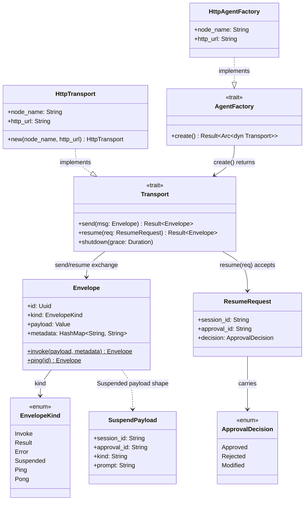

# Wire Protocol & Transport

## Purpose

This is the contract every agent process speaks to Aether, and the HTTP
mechanics that carry it. `Envelope` is the sole message shape crossing the
process boundary — `Invoke` in, `Result`/`Error`/`Suspended` back — framed as
newline-delimited JSON in the wire-protocol spec. `Transport` and
`AgentFactory` are the traits that abstract "reach an agent process";
`HttpTransport`/`HttpAgentFactory` are their only current implementation,
POSTing `Envelope`s to an agent's `/aether/invoke` and `/aether/resume`
endpoints. It exists as its own layer so "what bytes does an agent
understand" (wire format) stays independent of "how do we compose and run
agents" (orchestration) and "how do we survive a crash or a paused human
decision" (durable execution) — those layers depend on this one, never the
reverse.

## Position in the System

- Consumes: external agent HTTP services — any process implementing the
  Envelope contract on `/aether/invoke` (and, for HITL-capable agents,
  `/aether/resume`).
- Consumed by: [Orchestration Core](orchestration-core.md) — `Supervisor`'s
  `InstanceManager` holds `AgentFactory`-created `Transport`s and calls
  `Transport::send` to dispatch every node. [Durable Execution](durable-execution.md)
  — resume routing (`InstanceManager::resume`, `Supervisor::resume_execution`)
  delivers a human decision back to a parked node over the same `Transport`.

## Architecture

`Envelope` is `{ id: Uuid, kind: EnvelopeKind, payload: Value, metadata:
HashMap<String, String> }`. `EnvelopeKind::invoke` and `EnvelopeKind::ping`
are the only two constructors; every other kind (`Result`, `Error`,
`Suspended`, `Pong`) is produced by the agent side and simply deserialized.
`payload_text` is the one piece of payload-shaping logic that lives on the
`Envelope` side of the boundary: given an arbitrary JSON value, it returns a
plain string by checking object keys in the order `input`, `output`,
`message`, `goal`, and otherwise joining nested values with `\n\n---\n\n`
(objects by value, arrays by element) — this is what lets one function read
both a fan-in map keyed by upstream node id and a single prior node's
`{"output": ...}` reply. `write_envelope`/`read_envelope` implement the
newline-delimited JSON framing the original wire-protocol spec calls for:
serialize to one line, `\n`-terminate, flush; on read, one `read_line` call
per `Envelope`, `Ok(None)` on EOF.

`Transport` (`send`, `resume`, `shutdown`) and `AgentFactory` (`create`) are
the two traits every agent-reaching call goes through. `resume` has a
default implementation that returns `AetherError::TransportError` with an
"unsupported" message, so any future non-HTTP `Transport` compiles without
implementing resume support. `HttpTransport` is the only implementation:
`send` POSTs to `{http_url}/aether/invoke`, `resume` POSTs a `ResumeRequest`
to `{http_url}/aether/resume`, `shutdown` is a no-op (HTTP has no process to
signal). `HttpAgentFactory::create` just constructs a fresh `HttpTransport`
for a given `node_name`/`http_url` pair. `SuspendPayload` (agent → aether, on
an `EnvelopeKind::Suspended` response) and `ResumeRequest`/`ApprovalDecision`
(aether → agent, on `/aether/resume`) are the HITL wire types layered on top
of the base `Invoke`/`Result`/`Error` exchange.

## Runtime Flows

**1. Dispatch an `Invoke` and receive a `Result`.**
1. `InstanceManager::dispatch` (called from `Supervisor`'s drive loop —
   see [Orchestration Core](orchestration-core.md)) resolves or creates a
   `Transport` for the target node — via `AgentFactory::create` for a
   `PerRequest` node, or a pre-initialized `Singleton`/`Pool` transport
   otherwise — and calls `Transport::send(Envelope::invoke(payload, metadata))`
   under `node.timeout`.
2. `HttpTransport::send` POSTs the wrapped envelope (see flow 2) to
   `{http_url}/aether/invoke` and deserializes the JSON response body back
   into an `Envelope`.
3. A connection failure or a response body that fails to deserialize as
   `Envelope` becomes `AetherError::TransportError { node, message }`; a
   `node.timeout` elapsing becomes `AetherError::AgentTimeout { node }` — both
   carry the node name, which `Outcome::Failed` surfaces to the caller.

**2. Bridge to the AgentVerse `{input}`/`{output}` envelope contract.**
1. Whatever node-input payload the orchestrator produced — the initial goal,
   a prior node's `{"output": ...}` reply, or a fan-in map keyed by upstream
   node id — arrives at `HttpTransport::send` as `Envelope.payload`.
2. `HttpTransport::send` does not forward that payload verbatim: it calls
   `payload_text(&msg.payload)` to flatten it to one string, then rebuilds
   the outbound envelope with `payload: {"input": <text>}` before POSTing to
   `/aether/invoke`.
3. The AgentVerse built-in HTTP server reads `payload.input`, runs the agent,
   and replies with `Envelope { kind: Result, payload: {"output": ...} }`
   unmodified by `HttpTransport`; `payload_text`'s `output`-key precedence is
   what lets the *next* hop's outbound wrap read that reply as its own input
   without a second bridge.

**3. A node suspends for a human decision, then resumes.**
1. Instead of `Result`/`Error`, the agent returns
   `Envelope { kind: Suspended, payload: <SuspendPayload> }` from
   `/aether/invoke`. The Supervisor's drive loop (documented in
   [Durable Execution](durable-execution.md)) parks the node — the run
   returns `Outcome::Suspended` rather than blocking.
2. An operator (or driver) later calls `Supervisor::resume_execution` with an
   `ApprovalDecision`; it builds a `ResumeRequest { session_id, approval_id,
   decision }` from the parked node's stored correlation and calls
   `InstanceManager::resume(node, req)`, which routes to the same
   `Singleton`/`Pool`/`PerRequest` transport `dispatch` would have used.
3. `HttpTransport::resume` POSTs the `ResumeRequest` to
   `{http_url}/aether/resume`. The agent's reply is `Result`, `Error`, or
   *another* `Suspended` — a resume can itself re-interrupt, in which case
   `resume_execution` re-parks the node with the new `SuspendPayload` instead
   of completing it.

## Key Decisions

### `HttpTransport::send` wraps every payload into the AgentVerse `{input}`/`{output}` contract
- **Decision:** `HttpTransport::send` always rewrites the outbound envelope's
  payload to `{"input": payload_text(&msg.payload)}` rather than forwarding
  the orchestrator's payload shape as-is.
- **Context:** the PR #5 body describes rebasing the `llm-planner` example
  off hand-rolled per-agent servers onto AgentVerse's built-in HTTP server,
  which requires speaking that server's own envelope shape: "`payload_text` +
  `HttpTransport::send` wrap to the built-in `{input}`/`{output}` contract."
  A follow-up commit note explains why the first version of the wrap test
  didn't catch a regression: the original test payload (`{"input": "hi"}`)
  was already a no-op through `payload_text`, so the wrap could be silently
  removed without failing it.
- **Alternatives rejected:** No PR or design doc records alternatives
  considered; observed current state: the wrap is unconditional inside
  `HttpTransport::send` — there is no per-agent flag to opt out of it, so any
  future non-AgentVerse HTTP agent must also accept `{"input": <text>}`.
- **Consequences:** every node-input shape the orchestrator can produce (goal
  string, single prior output, multi-dependency fan-in map) collapses to one
  string field on the wire; `HttpTransport::send`'s own test suite had to be
  rewritten with a non-identity payload (`{"goal": "hi"}`) to actually
  exercise the wrap.
- **Ref:** 2026-07-19, PR #5, commits `2e7203c`, `7eb1cac`.

### `Suspended` envelope kind + `resume` as an additive `Transport` method
- **Decision:** `EnvelopeKind` gains a `Suspended` variant carrying a
  `SuspendPayload`; `Transport` gains a `resume` method with a default
  "unsupported" implementation, overridden by `HttpTransport` to POST
  `ResumeRequest` to `/aether/resume`; `InstanceManager::resume` routes to a
  node's existing transport exactly like `dispatch`.
- **Context:** the design doc (untracked) states the motivating gap directly:
  "The Envelope protocol has no way for an agent to say 'I am pausing for a
  human — come back later' ... The Supervisor blocks on `Transport::send`
  until a `Result`/`Error` returns," while the agentverse side already
  implements durable HITL by returning `AgentOutput::Interrupted` instead of
  blocking. Separately, §2.4 of that doc frames aether's role: "Aether takes
  that seat ... Aether does not implement its own approval queue, policy, or
  `InterruptedState`; those remain agentverse's concern" — aether only relays
  the decision and drives the workflow forward.
- **Alternatives rejected:** the design doc's §2 records three rejected
  framings for durability generally — a per-agent runtime owning its own
  suspend/resume lifecycle (§2.1, rejected because distributing durable
  run-state across N per-agent units makes recovery and debugging hard),
  Temporal or another external durable-execution engine (§2.2, rejected as
  unneeded weight on top of a DAG engine aether already is), and reifying a
  `Worker`/`Executor` type (§2.3, rejected as a single-use abstraction).
- **Consequences:** `resume`'s default-unsupported implementation means this
  was a non-breaking addition to `Transport` — no existing transport
  implementation had to change to keep compiling; `InstanceManager::resume`
  duplicates `dispatch`'s `Singleton`/`Pool`/`PerRequest` routing logic rather
  than sharing it.
- **Ref:** 2026-07-18, PR #4, commits `7b3ee35`, `ba7438e`.

### HTTP stays the sole transport boundary; an in-process `Transport` was considered and rejected
- **Decision:** `HttpTransport`/`HttpAgentFactory` remain the only `Transport`
  implementation; when the suspend/resume design revisited the transport
  boundary, an in-process alternative was evaluated and explicitly rejected.
- **Context:** aether-core had earlier implementations of `StdioTransport`
  (commit `0442a47`) and then `UnixSocketTransport` (commit `8fda8ce`) before
  the HTTP-registry plan replaced Unix sockets with HTTP outright (commits
  `3ace5fe`, `ef3c864`) — no PR or design doc records *why* that first switch
  happened, only that the plan's stated goal paired the new HTTP transport
  with a self-registering, SQLite-backed `RegistryStore` keyed by `http_url`
  rather than a local socket path. The question resurfaced later: resume
  needed a way to reach a parked agent's endpoint again.
- **Alternatives rejected:** the design doc (untracked, §2.5) states an
  in-process `Transport` was rejected because it "would re-couple agent to
  aether's process against the deployability goal," and because it "would not
  simplify this design (the suspend correlation must be persisted
  regardless)."
- **Consequences:** every agent process — whether or not it ever suspends —
  must expose `/aether/invoke` as an HTTP endpoint reachable from the
  Supervisor; one that uses HITL must also expose `/aether/resume`.
- **Ref:** 2026-07-18, PR #4 (design doc §2.5, untracked); commit `ef3c864`.

### Agent timeout raised to 300s; `TransportError` carries the failing node name
- **Decision:** `HttpTransport`'s `reqwest::Client` timeout and the
  `AgentNode` dispatch timeout both moved from 60s to 300s;
  `Supervisor`'s dispatch path was changed to preserve the failing node's
  name in `Outcome::Failed` instead of letting a catch-all clear it to `""`.
- **Context:** the commit message states the trigger directly: "Local LLMs
  serialise concurrent requests, so the third parallel agent (cost) can wait
  for pros + cons before its own LLM call starts. The old 60-second reqwest /
  node timeout fires before the response arrives, producing a misleading
  empty-node failure."
- **Alternatives rejected:** No PR or design doc records alternatives
  considered; observed current state: the timeout is a single fixed value
  shared by every node rather than per-node configurable at the transport
  layer (per-node values do exist on `AgentNode.timeout`, but the underlying
  `reqwest::Client` timeout baked into `HttpTransport::new` is fixed at 300s
  regardless).
- **Consequences:** a hung agent now blocks its node for up to 5 minutes
  before `AetherError::AgentTimeout` fires; failure diagnostics name the
  actual stuck node instead of an empty string.
- **Ref:** 2026-06-24, PR #3, commit `3762504`.

### Newline-delimited JSON as the Envelope wire encoding
- **Decision:** `write_envelope`/`read_envelope` frame each `Envelope` as one
  line of JSON terminated by `\n`, read back with a single `read_line` call
  per envelope.
- **Context:** the original design spec states this as the starting contract:
  "The sole contract between Aether and AgentVerse. Newline-delimited JSON,"
  written against the stdio/Unix-socket transports of that era, where
  multiple `Envelope`s could be exchanged over one long-lived connection.
- **Alternatives rejected:** No PR or design doc records alternatives
  considered; observed current state: `HttpTransport` does not call
  `write_envelope`/`read_envelope` at all — it serializes/deserializes a
  single `Envelope` as a whole HTTP request/response body via reqwest's
  `.json()` — so the NDJSON codec is exercised only by its own unit tests
  today, not by the transport actually shipping.
- **Consequences:** the codec functions and their line-framing behavior are
  effectively dormant on the current HTTP-only path; reviving a
  streaming/multi-message transport (e.g. a WebSocket or the stdio mode the
  original spec sketched) would be the first consumer to exercise them
  outside tests.
- **Ref:** 2026-05-17, commit `e8dd39f`.

## Implementation Notes

- **Gotcha (dead code):** `read_envelope`/`write_envelope` are `pub use`-exported
  from `lib.rs` but have no caller anywhere in `aether-core`, `aether-mcp`, or
  `aether-dashboard` outside their own `#[cfg(test)]` module.
  `HttpTransport` sends/receives whole-body JSON via `reqwest`'s `.json()`
  instead. This is vestigial from the removed stdio/Unix-socket transports,
  not a wired code path.
- **Gotcha (unwired kind):** `EnvelopeKind::Ping`/`Pong` and the
  `Envelope::ping` constructor exist and round-trip in tests, but nothing in
  `InstanceManager` or `HttpTransport` ever sends a `Ping`. The original
  design spec described periodic `Ping`/`Pong` health probes; what actually
  ships is a separate, unrelated HTTP `/health` endpoint polled by
  `health_poller` outside the `Transport`/`Envelope` path entirely.
- **Invariant:** `Transport::resume`'s default implementation always returns
  `AetherError::TransportError` with an "unsupported" message — any new
  `Transport` implementation silently does not support resume until it
  overrides this method.
- **Invariant:** `HttpTransport::send` unconditionally rewrites the outbound
  payload to `{"input": payload_text(&msg.payload)}`; a `Transport`
  implementation that talks to a non-AgentVerse agent expecting a different
  payload shape cannot reuse `HttpTransport` as-is.
- **Invariant:** `InstanceManager::dispatch` and `InstanceManager::resume`
  route identically (`Singleton` → shared locked transport with a queue
  check, `Pool` → round-robin cursor, `PerRequest` → create/call/shutdown),
  so a resumed node always reaches the same class of transport instance its
  original `Invoke` did — but for `PerRequest` nodes, `resume` spins up a
  fresh `Transport` via `AgentFactory::create` rather than reaching back to
  the same process that suspended; correctness there depends on the agent's
  own session store being addressable by `session_id`, not on process
  identity.

## Source Anchors

- `aether-core/src/envelope.rs`
- `aether-core/src/transport/mod.rs`
- `aether-core/src/transport/http.rs`
- `aether-core/src/resume.rs`

<!-- The drift contract: a PR changing files under these anchors updates this page
     or says why not in the PR body. -->

## Related Pages

- [Orchestration Core](orchestration-core.md)
- [Durable Execution](durable-execution.md)
- [Examples](examples.md)
